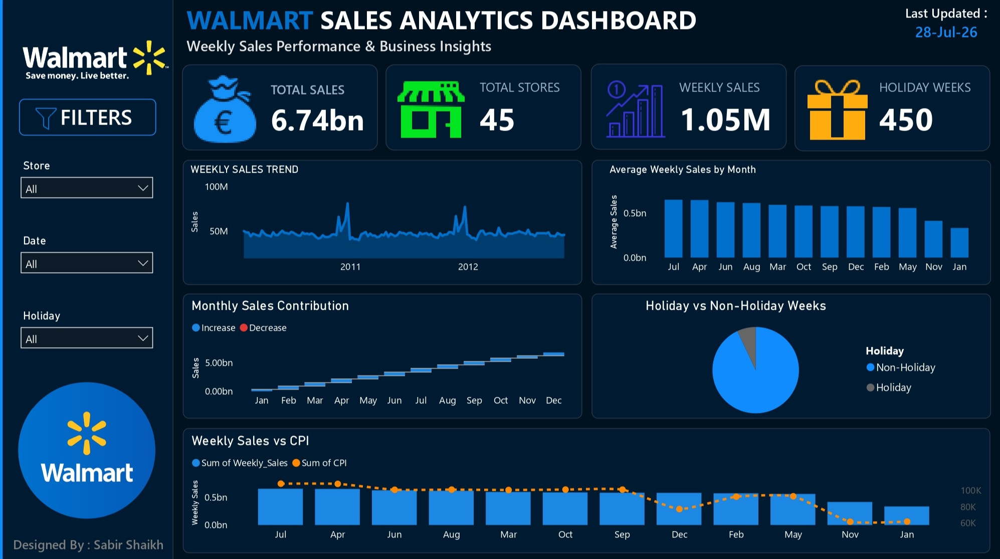

# 🛒 Walmart Sales Analytics Dashboard

<p align="center">
  
</p>

<p align="center">


</p>

---

# 📌 About the Project

This project presents a **professional Walmart Sales Analytics Dashboard** developed using **Power BI** and **Python** to analyze retail sales performance, seasonal trends, store performance, holiday impact, and external economic indicators.

The dashboard enables users to explore key business metrics through an intuitive and interactive interface.

---

# 📊 Dashboard Preview

<p align="center">

</p>

---

# 🚀 Dashboard Highlights

- 💰 Total Sales KPI
- 🏪 Store Performance Analysis
- 📈 Weekly Sales Trend
- 📅 Monthly Sales Analysis
- 🌊 Monthly Sales Contribution
- 🎄 Holiday vs Non-Holiday Comparison
- 📊 CPI & Fuel Price Impact
- 🌡 Temperature Analysis
- 🎯 Interactive Filters
- 🌙 Modern Dark UI Design

---

# 📸 Visual Insights

<table>
<tr>
<td align="center">
<b>Weekly Sales Trend</b><br>

</td>

<td align="center">
<b>Average Monthly Sales</b><br>

</td>
</tr>

<tr>
<td align="center">
<b>Top Performing Stores</b><br>

</td>

<td align="center">
<b>Holiday Sales Comparison</b><br>

</td>
</tr>

<tr>
<td align="center">
<b>CPI vs Weekly Sales</b><br>

</td>

<td align="center">
<b>Fuel Price vs Weekly Sales</b><br>

</td>
</tr>

<tr>
<td align="center">
<b>Temperature vs Weekly Sales</b><br>

</td>

<td align="center">
<b>Correlation Matrix</b><br>

</td>
</tr>
</table>

---

# 📌 Key KPIs

| Metric | Value |
|---------|------:|
| 💰 Total Sales | **6.74B** |
| 🏪 Total Stores | **45** |
| 📈 Average Weekly Sales | **1.05M** |
| 🎄 Holiday Weeks | **450** |

---

# 💡 Business Insights

- Weekly sales reveal clear seasonal demand patterns.
- Holiday periods have a measurable impact on retail performance.
- A small number of stores contribute a significant share of total sales.
- Economic indicators such as CPI and fuel prices influence weekly sales trends.
- The dashboard enables quick identification of business opportunities through interactive exploration.

---

# 🛠️ Tech Stack

| Category | Technologies |
|----------|--------------|
| Dashboard | Power BI |
| Programming | Python |
| Data Analysis | Pandas, NumPy |
| Visualization | Matplotlib, Seaborn |
| Development | Jupyter Notebook |

---

# 📂 Repository Structure

```text
Walmart-Sales-Analytics-Dashboard
│
├── Dashboard
│   ├── Walmart Sales Analytics Dashboard.pbix
│   ├── Walmart Sales Analytics Dashboard.pdf
│   └── Thumbnail.jpg
│
├── Dataset
│   └── Walmart.csv
│
├── Notebook
│   └── Walmart_Sales_Analysis.ipynb
│
├── Charts
│   ├── Dashboard Preview.png
│   ├── Overall Weekly Sales Trend.png
│   ├── Average Monthly Sales.png
│   ├── Top 10 Walmart Stores by Total Sales.png
│   ├── Weekly Sales During Holiday vs Non-Holiday.png
│   ├── CPI vs Weekly Sales.png
│   ├── Fuel Price vs Weekly Sales.png
│   ├── Temperature vs Weekly Sales.png
│   ├── Correlation Matrix.png
│   └── ...
│
└── README.md
```

---

# ▶️ Getting Started

### Clone the repository

```bash
git clone https://github.com/sabirshaikh712/Walmart-Sales-Analytics-Dashboard.git
```

### Open the Dashboard

- Install **Power BI Desktop**
- Open the `.pbix` file from the **Dashboard** folder.

### Run the Notebook

```bash
pip install pandas numpy matplotlib seaborn
```

Then open:

```text
Notebook/Walmart_Sales_Analysis.ipynb
```

---

# ⭐ Support

If you found this project useful, consider giving it a ⭐ on GitHub.

---

# 👨‍💻 Author

## Sabir Shaikh


<p align="center">
⭐ Thanks for visiting this repository! ⭐
</p>
